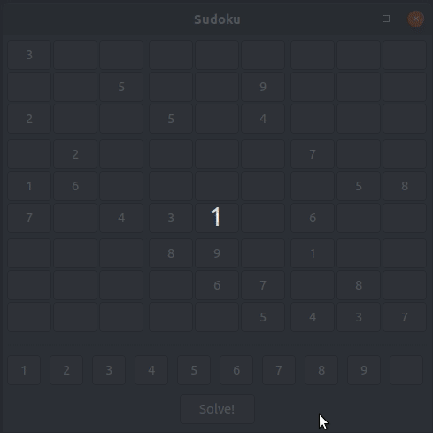
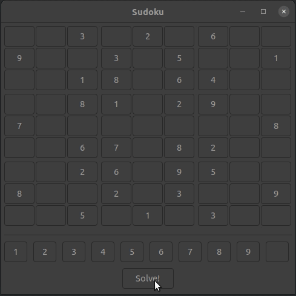
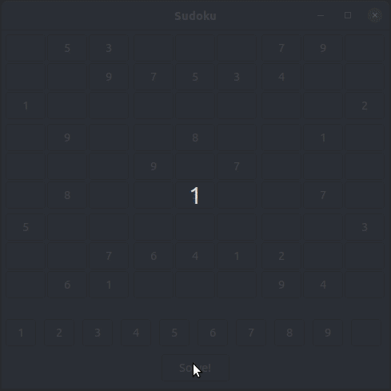
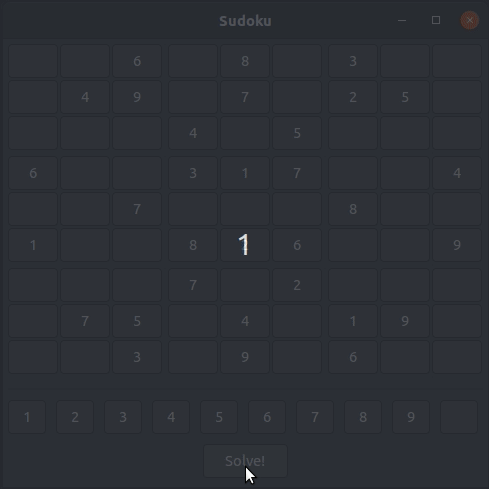

# Sudoku Solver

## Goal

My goal was to write a Sudoku solver that showed each step of the
algorithm in a GUI. I started by creating the Sudoku game board in
wxpython and then implemented the algorithm from there. This has been
an incredibly interesting project, and it feels like something that I
could continue to work on forever (user interface improvements, code
improvements, game features, etc). For now I have achieved that goal,
and even exceeded it by writing two different versions of the
algorithm. The first version very naively tries a number in a cell,
checks if that number caused any Sudoku violations, and then moves
on. The second version keeps track of three Sudoku boards in memory
(the original, a rotated board, and a board with the original 3x3
subgrids mapped to rows) and therefore only places valid numbers into
cells, thus avoiding the costly check for violations after a number
has been placed. This second version also immediately iterates through
the board and fills in cells whose only option is a single valid
number, which allows certain boards to be solved very, very quickly.

## Play Sudoku

The board is interactive. To play:
1. Click a cell to highlight it.
2. Select a number from the bottom to enter.
3. Repeat until solved!

## Animated Solve

Using main.py (naive backtracking):

Using fast_main.py (keeps track of three boards in memory):

A very fast solve using fast_main.py (repeatedly fills in cells whose only valid choice is a single value):
